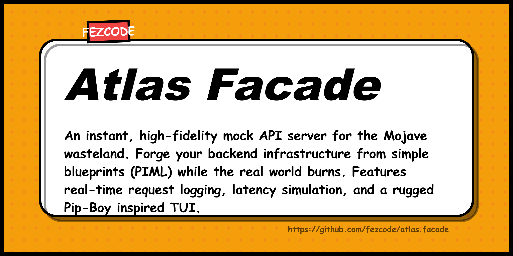

# atlas.facade 📻



**atlas.facade** is a retro-future, Pip-Boy inspired mock API server. Part of the **Atlas Suite**, it allows you to prototype frontends instantly by forging backend responses from simple PIML blueprints.


## ✨ Features

- 🏗️ **PIML Blueprints:** Define routes, status codes, and bodies in a human-readable format.
- ⏳ **Latency Simulation:** Test your frontend's loading states with per-route delays.
- 📟 **Pip-Boy TUI:** High-fidelity Amber CRT interface with real-time request logging.
- 📡 **Lightweight:** Zero dependencies, built with standard Go `net/http`.
- 📦 **One-Key Installation:** Managed via `atlas.hub`.

## 🚀 Installation

### Recommended: Via Atlas Hub
```bash
atlas.hub
```
Select `atlas.facade` from the list and confirm.

### From Source
```bash
git clone https://github.com/fezcode/atlas.facade
cd atlas.facade
gobake build
```

## ⌨️ Usage

1. Create a `routes.piml` file:
```piml
(routes)
  > (route)
    (path) /v1/status
    (method) GET
    (status) 200
    (body) {"status": "Nominal"}
    (latency) 500ms
```

2. Start the server:
```bash
./atlas.facade --file routes.piml --port 4000
```

## 📄 License
MIT License - see [LICENSE](LICENSE) for details.
